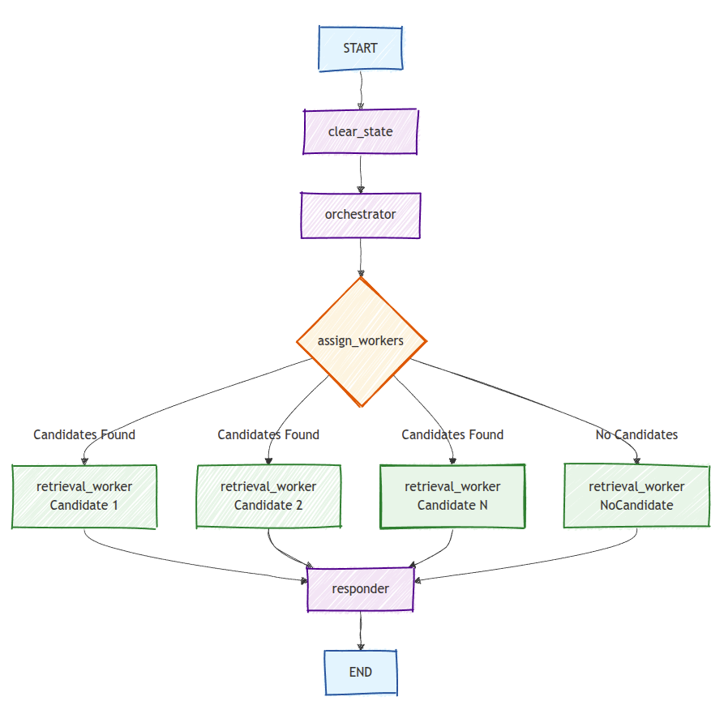

# Resume Q&A Agent - RAG System with LangGraph

A Retrieval-Augmented Generation (RAG) system for querying candidate resumes using LangGraph, OpenAI/Groq LLMs, and Pinecone vector database. The system provides both command-line and web interfaces for resume analysis.

## Architecture Overview

This project implements an agent workflow using LangGraph that can extract candidate names from user queries, retrieve relevant resume information from Pinecone vector databases, and provide conversational responses.



### Workflow Components

1. **Clear State**: Resets context from previous conversation turns
2. **Orchestrator**: Extracts and matches candidate names against available CVs
3. **Assign Workers**: Distributes retrieval tasks to parallel workers for each candidate
4. **Retrieval Workers**: Perform semantic search and reranking for each candidate
5. **Responder**: Synthesizes information from all candidates into a coherent response

## Project Structure

```
tp3/
├── README.md                    # This file
├── requirements.txt             # Python dependencies
├── .env.example                 # Environment variables template
├── .env                         # Your environment variables (create from .env.example)
│
├── resume_qa_agent_cli.py       # Command-line interface
├── resume_qa_agent_gui.py       # Web interface (Dash app)
├── langgraph_flow.py            # Core LangGraph workflow implementation
│
├── embeddings.py                # Vector database population script
├── resume_management.py         # Resume parsing utilities
│
├── cvs/                         # Resume files directory
│   ├── john_doe_resume.txt
│   ├── mark_nash_resume.txt
│   └── rebecca_johnson_resume.txt
│
└── imgs/
    └── langgraph_flow.png      # Workflow diagram
```

## Quick Start

### 1. Environment Setup

Create and activate a Python virtual environment:

```bash
# Create virtual environment
python -m venv venv

# Activate virtual environment
# On Linux/macOS:
source venv/bin/activate

# On Windows:
# venv\Scripts\activate
```

### 2. Install Dependencies

```bash
pip install -r requirements.txt
```

### 3. Environment Variables

Copy the example environment file and configure your API keys:

```bash
cp .env.example .env
```

Edit `.env` with your actual API keys:

```env
# Required API Keys
PINECONE_API_KEY=your_pinecone_api_key_here
OPENAI_API_KEY=your_openai_api_key_here

# Optional: Use Groq instead of OpenAI
GROQ_API_KEY=your_groq_api_key_here
MODEL_TYPE=openai  # or "groq"

# Model Configuration
MODEL_NAME=gpt-4o
MODEL_TEMPERATURE=0.1
EMBEDDING_MODEL=text-embedding-3-small
EMBEDDING_DIMENSIONS=768

# Data Configuration
CVS_DIR=./cvs
DEFAULT_CHUNK_SIZE=625
DEFAULT_CHUNK_OVERLAP=125
MESSAGE_HISTORY_LIMIT=4
```

### 4. Populate Vector Database

Before using the agents, you need to populate the Pinecone vector database with resume embeddings:

```bash
python embeddings.py
```

This script:
- Reads all `.txt` files from the `cvs/` directory
- Chunks each resume into overlapping segments
- Creates separate Pinecone indexes for each candidate
- Uploads embeddings using OpenAI's text-embedding-3-small model

## Usage

### Web Interface (Recommended)

Launch the Dash web application:

```bash
python resume_qa_agent_gui.py
```

Then open your browser to `http://localhost:8051`

**Features:**
- Modern, responsive web interface
- Real-time chat with loading indicators
- Conversation history with memory
- Async processing for smooth user experience
- Bootstrap-styled components

**Example Queries:**
- "What is Rebecca's experience with MATLAB?"
- "Where did John Doe and Mark Nash work in August 2025?"
- "Tell me about Rebecca Johnson's education background"

### Command Line Interface

For a simpler command-line experience:

```bash
python resume_qa_agent_cli.py
```

Type your questions and press Enter. Type 'exit' or 'quit' to stop.

## How RAG Works in This System

### Multi-Index Architecture

Each candidate has their own Pinecone index:
- `john-doe-index`: Contains John Doe's resume chunks
- `mark-nash-index`: Contains Mark Nash's resume chunks  
- `rebecca-johnson-index`: Contains Rebecca Johnson's resume chunks

### Candidate Matching

The **Orchestrator** node uses an enhanced prompt that:
1. Lists all available candidates from the `cvs/` directory
2. Performs fuzzy matching on partial names (e.g., "Rebecca" → "Rebecca Johnson")
3. Handles variations and nicknames
4. Returns exact full names for retrieval

### Retrieval Process

For each identified candidate:

1. **Semantic Search**: Uses OpenAI embeddings to find top-5 relevant chunks (cosine similarity > 0.35)
2. **Reranking**: Applies Pinecone's BGE reranker model to select top-3 most relevant chunks
3. **Context Assembly**: Concatenates retrieved chunks with candidate identification

### Response Generation

The **Responder** node:
- Synthesizes information from all candidates
- Uses conversation history for context
- Generates natural, conversational responses
- Avoids bullet points and lists for fluid conversation

## Configuration

### Model Selection

Switch between OpenAI and Groq models by setting `MODEL_TYPE` in your `.env`:

```env
# Use OpenAI (recommended)
MODEL_TYPE=openai
MODEL_NAME=gpt-4o

# Or use Groq (faster, more cost-effective)
MODEL_TYPE=groq
MODEL_NAME=llama3-8b-8192
```

### Chunking Parameters

Adjust text chunking in `.env`:

```env
DEFAULT_CHUNK_SIZE=625      # Characters per chunk
DEFAULT_CHUNK_OVERLAP=125   # Overlap between chunks
```

### Memory and History

Control conversation memory:

```env
MESSAGE_HISTORY_LIMIT=4     # Number of previous messages to include in context
```

## System Components

### Core Files

- **`embeddings.py`**: Vector database population and management
- **`resume_management.py`**: Resume parsing and chunking utilities
- **`langgraph_flow.py`**: Contains the complete LangGraph workflow definition
- **`resume_qa_agent_cli.py`**: Simple command-line interface
- **`resume_qa_agent_gui.py`**: Dash web application with async processing

### Data Flow

1. **Input**: User asks a question via web/CLI interface
2. **Orchestration**: LLM extracts candidate names from the query
3. **Parallel Retrieval**: Multiple workers search respective Pinecone indexes
4. **Reranking**: BGE model reranks retrieved chunks for relevance
5. **Response**: LLM synthesizes information into conversational answer

## Troubleshooting

### Common Issues

**"No resume found for [candidate]"**
- Ensure the candidate's resume is in the `cvs/` directory
- Run `python embeddings.py` to create/update indexes
- Check that filename follows the pattern: `firstname_lastname_resume.txt`

**API Key Errors**
- Verify your `.env` file contains valid API keys
- Ensure environment variables are loaded correctly

**Import Errors**
- Activate your virtual environment: `source venv/bin/activate`
- Install dependencies: `pip install -r requirements.txt`

## Adding New Resumes

1. Add new resume files to the `cvs/` directory following the naming convention: `firstname_lastname_resume.txt`
2. Run the embeddings script to create new indexes:
   ```bash
   python embeddings.py
   ```
3. The system will automatically detect and include new candidates in future queries

## Advanced Features

- **Conversation Memory**: Each session maintains context across multiple questions
- **Parallel Processing**: Multiple candidates are processed simultaneously for faster responses
- **Smart Name Matching**: Handles partial names, variations, and fuzzy matching
- **Async Web Interface**: Non-blocking UI with real-time updates
- **Reranking**: Advanced relevance scoring beyond simple similarity